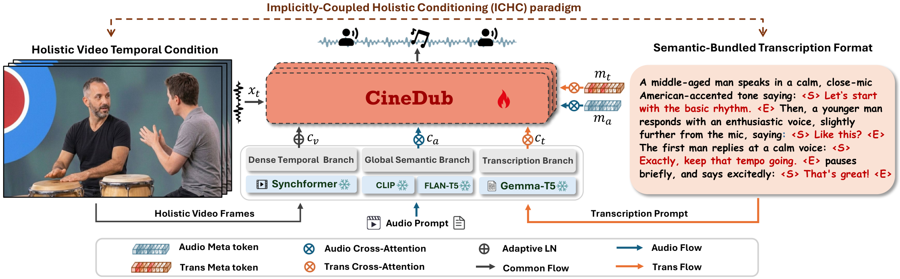

<h1 align="center">CineDub</h1>

<p align="center"><em>Video Dubbing with Coherent Sound Effects</em></p>

<p align="center"><b>Official implementation of the ACM MM 2026 paper</b><br/>
<i><a href="https://arxiv.org/abs/2608.15734">CineDub: Scaling End-to-End Video Dubbing to Multi-Speaker Dialogues with Coherent Sound Effects</a></i></p>

<p align="center">
  <a href="LICENSE"></a>
  <a href="https://huggingface.co/datasets/Dalision/cinedub_benchmark"></a>
  <a href="https://huggingface.co/Dalision/cinedub"></a>
  <a href="https://arxiv.org/abs/2608.15734"></a>
  <a href="https://cinedub2026.github.io/"></a>
</p>

<p align="center"></p>

CineDub is a **unified diffusion framework** that takes an **uncropped single video** and produces a fully dubbed soundtrack — dialogue for one or many speakers, ambient sound effects, or both jointly. A single DiT handles three tasks (**V2A**, **V2S**, **V2SA**) with **no face cropping**, **no explicit speaker diarization**, and **no per-task heads**.

---

## 📰 News

- **2026-09-05**: `v1.0.0` released and the repository is now **public**. See [`CHANGELOG.md`](CHANGELOG.md) for the full update record.
- **2026-08-16**: Paper accepted by **ACM MM 2026**; preprint available on [arXiv (2608.15734)](https://arxiv.org/abs/2608.15734).
- **2026-07-31**: Inference code, demo examples and the unified checkpoint ([Dalision/cinedub](https://huggingface.co/Dalision/cinedub)) prepared as a private preview.

---

## ✨ Highlights

- **🎯 Unified model** — a single DiT checkpoint handles **V2A** (video → sound effects), **V2S** (video → dubbed speech), and **V2SA** (joint speech + ambient) without task-specific heads or per-task fine-tuning.
- **🗣️ End-to-end multi-speaker dialogue dubbing** — feeds the video **as-is** (front-facing, profile, back-facing, or fully off-screen speakers all supported). **No face cropping. No speaker diarization.** Produces lip-aligned dialogue for one or many speakers directly from an uncropped clip.
- **🎤 Zero-shot voice cloning** — pass a short reference wav to clone the target voice. Works for both **single-speaker** (`ref_wav: "a.wav"`) and **multi-speaker dialogue** (`ref_wav: ["spkA.wav", "spkB.wav"]`), routed automatically by the field type.
- **📀 Two new benchmarks released** — [**CineDub-Multi**](https://huggingface.co/datasets/Dalision/cinedub_benchmark) for multi-speaker dialogue dubbing under realistic scenes, and [**CineDub-SA**](https://huggingface.co/datasets/Dalision/cinedub_benchmark) for joint video-to-speech-and-audio evaluation.

## Quick start

### 1. Environment

```bash
# Option A - conda environment:
conda env create -f environment.yml
conda activate cinedub

# Option B - pip only:
conda create -n cinedub python=3.10 -y && conda activate cinedub
pip install torch==2.10.0 torchvision==0.25.0 torchaudio==2.10.0 \
    --index-url https://download.pytorch.org/whl/cu128
pip install -r requirements.txt
```

`ffmpeg` (used for mp4 remux and online video feature extraction) is
pulled in by `environment.yml`. Under Option B, install it via
`conda install -c conda-forge ffmpeg=6` or your OS package manager.

Copy `.env.example` to `.env` and put your HuggingFace token in if you
plan to download gated models.

### 2. Model weights

The CineDub DiT checkpoint (ap_m4) is hosted at
[**Dalision/cinedub**](https://huggingface.co/Dalision/cinedub). Download with:

```bash
huggingface-cli login
huggingface-cli download Dalision/cinedub --local-dir weights/cinedub
```

Expected on-disk layout:

```
weights/cinedub/
├── model_config.json
└── checkpoint/
    └── step=300000.ckpt          # unified DiT (V2A + V2S + V2SA)
```

One checkpoint drives all three tasks — no separate multispeaker model.

Everything else the pipeline needs is auto-downloaded from HuggingFace on first run and cached in `~/.cache/huggingface/`, EXCEPT two encoders that need explicit pre-download:

```bash
# flan-t5-base — the loader references it by bare name, so it must exist locally at weights/flan-t5-base/
huggingface-cli download google/flan-t5-base --local-dir weights/flan-t5-base

# t5gemma-ml-ml-ul2 — gated repo. First accept the gate at https://huggingface.co/google/t5gemma-ml-ml-ul2 and export a valid HF_TOKEN, then:
huggingface-cli download google/t5gemma-ml-ml-ul2 --local-dir weights/google/t5gemma-ml-ml-ul2
```

### 3. Run the demo

```bash
bash scripts/demo_infer.sh v2a    # video → SFX
bash scripts/demo_infer.sh v2s    # video → dubbed speech
bash scripts/demo_infer.sh v2sa   # video → dubbed speech + ambient SFX
```

The script is a thin wrapper around `inference.py`. See the next section
for the raw Python CLI.

## Inference

CineDub reads a JSONL file where each line describes one inference request.
Or use `python inference.py --input clip.mp4 --task v2a` for a one-off
single clip. Three tasks are supported:

- **V2A** — video → sound effects, no speech.
- **V2S** — video → dubbed speech; supports both single-speaker and
  two-speaker dialogue in the same model. One of CineDub's core
  capabilities.
- **V2SA** — video → dubbed speech + ambient background.

### V2A - video → sound effects

Generates a SFX / ambient track aligned to the video. `trans_cap` is set
to the sentinel `"none_speech"` to disable the speech branch.

```bash
python inference.py --task v2a --input examples/v2a.jsonl --output ./out/v2a
# or the shell shortcut:
bash scripts/demo_infer.sh v2a
```

Corresponding JSONL row (`examples/v2a.jsonl`, 2 rows shipped):

```json
{"video_path": "examples/assets/drummers.mp4", "trans_cap": "none_speech", "text_prompt": "A group of drummers energetically perform on stage, creating a rhythmic symphony with their synchronized beats."}
```

Single-file shortcut:

```bash
python inference.py --input clip.mp4 --task v2a \
    --text_prompt "A fast, melodic run on an electric keyboard."
```

### V2S - video → dubbed speech (single or two-speaker)

Generates dubbed speech aligned to the on-screen speakers. Zero-shot voice
cloning is driven by `ref_wav`. `text_prompt` is set to the sentinel
`"clean speech"` to disable the SFX branch.

```bash
python inference.py --task v2s --input examples/v2s.jsonl --output ./out/v2s
# or:
bash scripts/demo_infer.sh v2s
```

Corresponding JSONL row (`examples/v2s.jsonl`, 2 rows shipped) —
two-speaker dialogue in default-voice mode (no `ref_wav`):

```json
{"video_path": "examples/assets/dialogue_madman.mp4", "trans_cap": "A woman says in a loud, high-pitched, and agitated voice: <S>You're sounding like a madman!<E> A man responds in a tense and forceful tone: <S>I won't pretend like everything's okay, Alice. It's how I got into this mess.<E>", "text_prompt": "clean speech"}
```

Without `ref_wav` the model uses a generic voice — expect a warning in
the logs.

#### V2S with zero-shot voice cloning

To clone a target voice, add `ref_wav` pointing at a short reference
clip. `examples/v2s_ap.jsonl` ships **4 rows** — two reference speakers,
each paired with two target clips — exercising the **single-speaker**
voice-cloning path end-to-end:

```bash
python inference.py --task v2s --input examples/v2s_ap.jsonl --output ./out/v2s_ap
```

Sample row (`examples/v2s_ap.jsonl`):

```json
{"video_path": "examples/assets/apc/group1_target1.mp4", "trans_cap": "A mature man with a standard American accent speaks in a clear, mid-range baritone. His delivery is measured and instructional, with a stable pitch and a neutral tone, recorded in a quiet, close-mic environment, saying: <S>It very much favors the reactant side.<E>", "text_prompt": "clean speech", "ref_wav": "examples/assets/apc/group1_ref.wav"}
```

Multi-speaker dialogue cloning is also supported — pass `ref_wav` as a
**list** and CineDub auto-switches to multi-speaker mode. Both shapes
are accepted:

```json
"ref_wav": ["spkA.wav", "spkB.wav"]
```

or with explicit per-speaker trim ranges:

```json
"ref_wav": [["spkA.wav", 0, 2.0], ["spkB.wav", 0, 1.0]]
```

> **Note.** List-form `ref_wav` is only auto-routed to multi-speaker
> mode when `--task v2sa`. For `--task v2s` with list-form `ref_wav`,
> pass `--use_multi_audio_prompt` explicitly to enable dual-speaker
> cloning; otherwise the first entry is used as single-speaker.

### V2SA - video → dubbed speech + ambient soundscape

Joint dubbing of **speech and ambient SFX in a single pass** — both
tracks are generated simultaneously from one video by the same DiT.
Requires both `trans_cap` (transcript with `<S>...<E>` per turn) and
`text_prompt` (SFX / ambient caption). `ref_wav` is optional; the
shipped rows use the model's default voice.

```bash
python inference.py --task v2sa --input examples/v2sa.jsonl --output ./out/v2sa
# or:
bash scripts/demo_infer.sh v2sa
```

Corresponding JSONL row (`examples/v2sa.jsonl`, 2 rows shipped):

```json
{"video_path": "examples/assets/vtsa_xylophone.mp4", "trans_cap": "A middle-aged man with an English accent speaks in a clear, medium-pitched voice. His pace is slow and deliberate, with a calm, instructional tone as he counts: <S>one, two, three, four, go.<E> After a brief musical interlude, he continues in the same manner: <S>And now you. one, two<E>", "text_prompt": "A man's voice counts in, followed by the bright, clear tones of a xylophone playing a simple melody. He then speaks again, giving another instruction."}
```

Single-file shortcut for V2SA:

```bash
python inference.py --input clip.mp4 --task v2sa \
    --ref_wav spkA.wav,spkB.wav \
    --trans_cap "<S>...<E> <S>...<E>" \
    --text_prompt "A dialogue in a cafe with ambient chatter."
```

Additional demo samples with full captions are available on the
project page: <https://cinedub2026.github.io/>.

### CLI reference

| Flag | Default | Notes |
|---|---|---|
| `--input`        | required | `.mp4` (single-file mode) or `.jsonl` (batch). Auto-detected. |
| `--task`         | required | one of `v2a`, `v2s`, `v2sa`. `v2as` is accepted as a deprecated alias. |
| `--output`       | `./output/<task>_<ts>` | Output directory. |
| `--ckpt`         | `$CINEDUB_CKPT` → `weights/cinedub/checkpoint/step=300000.ckpt` | v2sa auto-swaps to `$CINEDUB_CKPT_MULTISPEAKER` (defaults to the same unified checkpoint). |
| `--cfg`          | `auto` | Classifier-free guidance scale. **Auto-picked from `--task`: `v2a=2.5`, `v2s=7.0`, `v2sa=7.0`** — pass to override. |
| `--steps`        | `200` | Diffusion sampling steps. |
| `--seed`         | `-1` (random) | Any int ≥ 0 for reproducibility. |
| `--ref_wav`      | – | For v2s/v2sa with `--input <mp4>`. Single path or `spkA.wav,spkB.wav`. |
| `--text_prompt`  | – | SFX caption (v2a / v2sa). Only for `--input <mp4>`. |
| `--trans_cap`    | – | Transcript with `<S>...<E>` (v2s / v2sa). Only for `--input <mp4>`. |

> **On CFG:** speech generation needs stronger guidance than pure SFX. CineDub uses
> **CFG = 7.0** for V2S / V2SA (dialogue-carrying tasks) and **CFG = 2.5** for V2A (SFX only).
> The `--cfg` flag is auto-set from `--task` when not provided; pass `--cfg X` to override.

All legacy flags (`--dataset_config`, `--model_ckpt_path`, `--save_dir`,
`--cfg_scale`, `--tasks`) are still accepted for backward compatibility.

## Data format

Each JSONL row uses this minimal 4-field schema:

| Field         | Required | Type          | Description |
|---|---|---|---|
| `video_path`  | ✅ | str            | Path to the input mp4. |
| `trans_cap`   | ✅ | str            | Speech transcript wrapped as `<S>utterance<E>`, or literal `"none_speech"` sentinel to disable speech (V2A mode). |
| `text_prompt` | ✅ | str            | Natural-language SFX / ambient caption, or literal `"clean speech"` sentinel to disable SFX (V2S mode). |
| `ref_wav`     | optional | str or list | Zero-shot voice-clone reference. String for a single speaker; list for two speakers. |

### Meta-token cheatsheet

Two sentinel strings switch task mode without an explicit `task=` field:

| Mode | `trans_cap` | `text_prompt` |
|---|---|---|
| V2A  | `"none_speech"`                    | real SFX caption |
| V2S  | real transcript with `<S>...<E>`   | `"clean speech"` |
| V2SA | real transcript with `<S>...<E>`   | real SFX caption |

Under the hood, `generate_multimodal_tasks` inspects `trans_cap` and
`text_prompt` per row and stamps a `VTA / VA / VTS / TTS` prefix on the
sample id — you never write those prefixes yourself. `<S>...<E>` marks
each spoken utterance; multi-turn dialogue chains several pairs and matches
them, in speaker order, against the entries in `ref_wav`.

> **Note.** `id` / `wav` / `dur` / `feature` / `sr` / `dataset` / `split`
> fields are auto-derived by `inference.py` and should **not** be set by
> users. `id` is taken from the `video_path` basename; `dur` is measured
> with `ffprobe`; visual features are extracted on the fly from the mp4
> unless you point at pre-computed `.npy` files.

### Ref_wav shape

The total audio prompt fed to the model is **fixed at 3.0 s @ 16 kHz** (`_AP_FIXED_SAMPLES=48000` in `inference.py`); in dual-speaker mode each speaker gets up to **2.0 s** with a default 1.5 s / 1.5 s split.

> **Shipped defaults.** `examples/v2s_ap.jsonl` ships **single-speaker**
> voice cloning (str-form `ref_wav`) by default. The list forms below
> remain fully supported for your own multi-speaker experiments.

- **Single-speaker** — `"ref_wav": "spk.wav"` (str). Loader takes the first ~3 s at 16 kHz.
- **Two-speaker (default split)** — `"ref_wav": ["spkA.wav", "spkB.wav"]` (list of str). Auto-packed as 1.5 s + 1.5 s = 3.0 s.
- **Two-speaker (explicit trim)** — `"ref_wav": [["spkA.wav", 0, 2.0], ["spkB.wav", 0, 1.0]]` (list of `[path, start_sec, end_sec]` triples). **Constraint:** total `Σ (end − start) ≤ 3.0 s` and each per-speaker duration `≤ 2.0 s`; exceeding either is clipped.
- **Without `ref_wav`** — model uses a generic voice; expect a warning.

### Generating `trans_cap` automatically

Use the shipped prompts under `examples/prompts/` to build a well-formed
`trans_cap` for any clip. Paste your reference ASR transcript into
`{transcription}` and feed the prompt + the raw audio + a few sampled
frames to Gemini 2.5 Pro / GPT-4o / Claude. Full recipe:
`examples/prompts/README.md`.

- 1 speaker → `examples/prompts/singlespeaker_caption.txt`
- ≥ 2 speakers → `examples/prompts/multispeaker_caption.txt`

## Benchmark & evaluation

- **[`Dalision/cinedub_benchmark`](https://huggingface.co/datasets/Dalision/cinedub_benchmark)** — the two evaluation JSONL splits: `CineDub-Multi` (multi-speaker dubbing) and `CineDub-SA` (joint speech + SFX). Point `--input` at either to reproduce paper numbers.
- **[`Dalision/cinedub_eval`](https://github.com/dalision/cinedub_eval)** — evaluation harness (WER / SIM / UTMOS / MCD / SyncNet + FD-VGG / FD-PANNs / KL). Ships as a separate repo because it needs its own conda env (`av_benchmark`).

## Citation

```bibtex
@inproceedings{cinedub2026,
  title     = {CineDub: Scaling End-to-End Video Dubbing to Multi-Speaker Dialogues with Coherent Sound Effects},
  author    = {Dai, Yusheng and Wang, Kangdi and Gao, Baolong and Jiang, Yuxuan
               and Wang, Weiqiang and Ke, Qiuhong and Cai, Jianfei},
  booktitle = {Proceedings of the 34th ACM International Conference on Multimedia (MM '26)},
  year      = {2026},
  publisher = {ACM},
  url       = {https://arxiv.org/abs/2608.15734}
}
```

## Acknowledgements

CineDub builds on the following open-source projects — please credit them
if you reuse the corresponding modules:

- [Omni2Sound](https://github.com/omni2sound/Omni2Sound) — DiT + decoupled semantic/temporal conditioning design (CVPR 2026 Highlight).
- [stable-audio-tools](https://github.com/Stability-AI/stable-audio-tools) — training / inference scaffold. Vendored under `stable_audio_tools/`.

Model-weight licenses are separate from the source-code license:

- **CineDub weights** — MIT (code) + research-use terms disclosed on the model card at upload time.
- **SynchFormer** — CC BY-NC 4.0 (non-commercial).
- **DFN5B CLIP** — Apple ML Research License (research use only).
- **Gemma-T5** — Gemma Terms of Use (accept on HF).

## License

Source code is released under the **MIT License** (see `LICENSE`). Model
weights, benchmarks, and demo assets each carry their own terms — see
the HuggingFace model / dataset cards for the authoritative statement.
